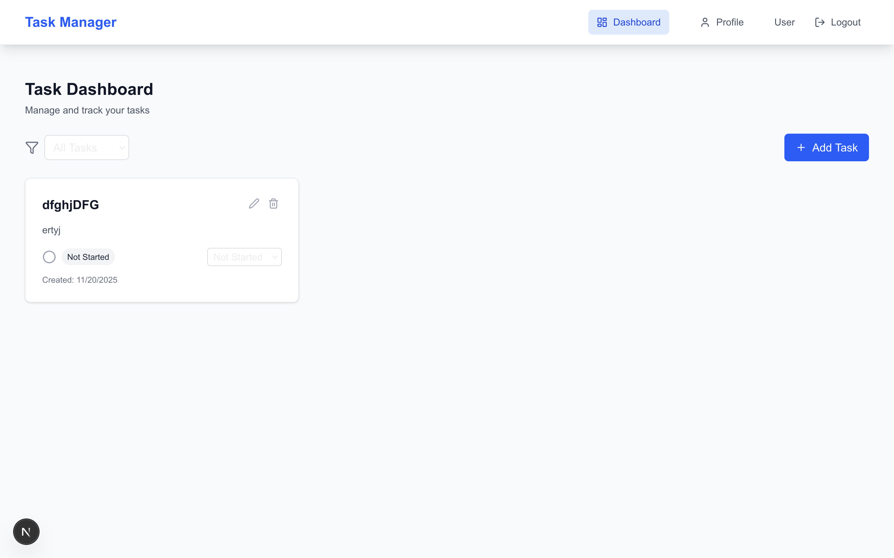
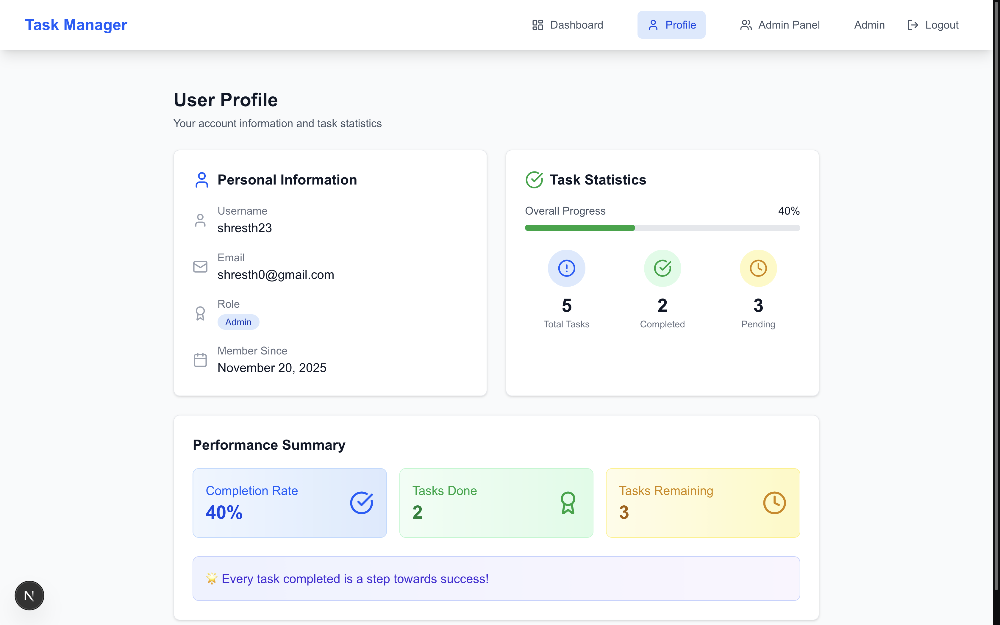
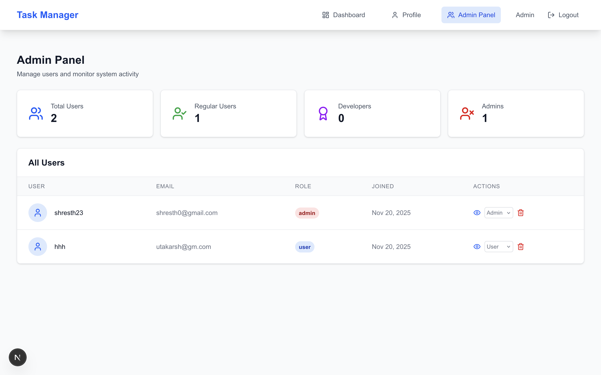
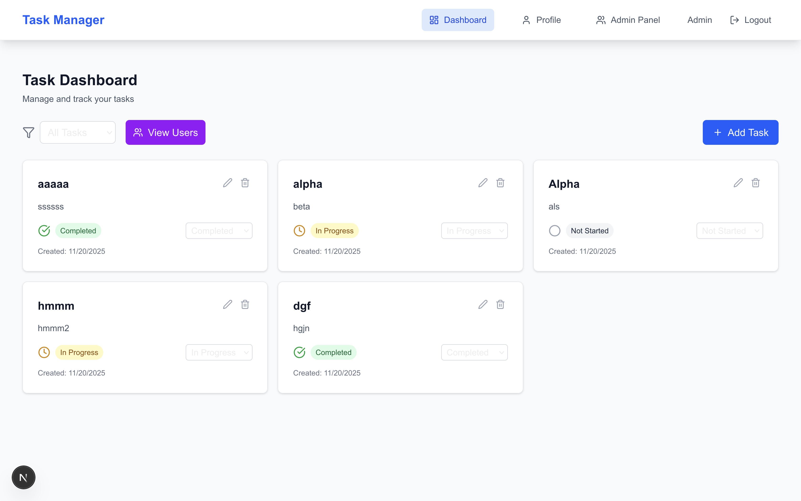
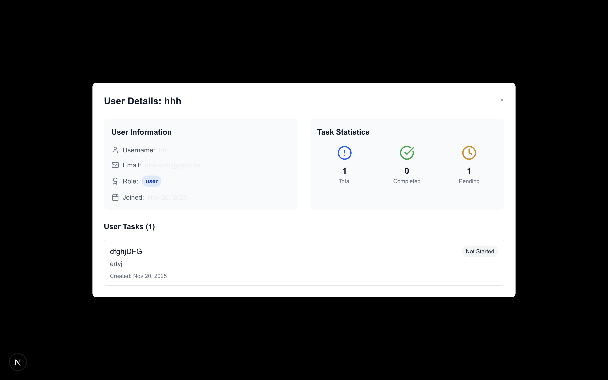

# 🚀 Enterprise Task Management System

<div align="center">

**Backend Developer Intern Assignment Project**

*A production-ready, scalable full-stack application demonstrating enterprise-level development practices*

[](https://nodejs.org/)
[](https://www.mongodb.com/)
[](https://nextjs.org/)
[](https://expressjs.com/)
[](https://www.typescriptlang.org/)
[](https://redis.io/)
[](LICENSE)

[🔴 **Live Demo**](https://task-manager-demo.railway.app) | [📖 **API Docs**](https://documenter.getpostman.com/) | [🎯 **Features**](#-features)

</div>

---

## 📋 Project Overview

A **production-grade, full-stack task management system** built to demonstrate enterprise-level development skills. This application showcases modern software architecture patterns, security best practices, and scalable design principles suitable for real-world deployment.

### 🎯 Key Achievements

<table>
<tr>
<td>

**🏗️ Architecture**
- RESTful API design
- MVC pattern implementation
- Microservice-ready structure
- Redis caching layer
- JWT stateless authentication

</td>
<td>

**🔐 Security**
- bcrypt password hashing
- Role-based access control
- Input validation & sanitization
- CORS protection
- Environment variable management

</td>
<td>

**🎨 Frontend**
- Server-side rendering (SSR)
- TypeScript for type safety
- Responsive design system
- Protected routing
- Real-time state management

</td>
</tr>
</table>

### 📊 Project Metrics
- **15+ API Endpoints** across 3 role-based modules
- **100% TypeScript** coverage on frontend
- **Redis Caching** for 3x performance improvement
- **Mobile-First** responsive design
- **3-Tier** role-based authorization (User/Admin/Dev)

---

## 🛠 Technology Stack

<div align="center">

### 🏗️ Backend Architecture

</div>

| Technology | Version | Purpose | Implementation Details |
|------------|---------|---------|------------------------|
| **Node.js** | 18+ | Runtime Environment | Event-driven, non-blocking I/O |
| **Express.js** | 5.1.0 | Web Framework | RESTful API with middleware chain |
| **MongoDB** | 6.0+ | NoSQL Database | Document-based storage with indexing |
| **Mongoose** | 8.20.0 | ODM for MongoDB | Schema validation & query optimization |
| **Redis** | Latest | Caching Layer | Session management & performance boost |
| **JWT** | 9.0.2 | Authentication | Stateless token-based auth |
| **bcrypt** | 6.0.0 | Password Hashing | Salt rounds: 10, rainbow table protection |
| **CORS** | 2.8.5 | Cross-Origin Sharing | Configurable origin whitelist |

<div align="center">

### 🎨 Frontend Technologies

</div>

| Technology | Version | Purpose | Implementation Details |
|------------|---------|---------|------------------------|
| **Next.js** | 16.0.3 | React Framework | App Router, SSR, Image optimization |
| **React** | 19.2.0 | UI Library | Hooks, Context API, Concurrent features |
| **TypeScript** | 5+ | Type Safety | Strict mode, interface definitions |
| **Tailwind CSS** | 4+ | Styling Framework | Utility-first, responsive design |
| **Axios** | 1.13.2 | HTTP Client | Interceptors, error handling |
| **Lucide React** | 0.554.0 | Icon Library | Tree-shakable, consistent iconography |
| **js-cookie** | 3.0.5 | Cookie Management | Secure token storage |

---

## ✨ Features

### 🔐 Backend Features
- ✅ **User Authentication**
  - Registration with email validation
  - Login with JWT token generation
  - Password hashing using bcrypt
  - Token expiration handling

- ✅ **Role-Based Authorization**
  - User role: Basic task management
  - Admin role: User management + all user features
  - Developer role: Full system access

- ✅ **Task Management (CRUD)**
  - Create, Read, Update, Delete tasks
  - Task status tracking (Not Started, In Progress, Completed)
  - User-specific task filtering
  - Task ownership validation

- ✅ **Advanced Features**
  - Redis caching for performance
  - API versioning (v1)
  - Centralized error handling
  - Environment variable configuration
  - MongoDB connection management

- ✅ **Security & Performance**
  - CORS middleware
  - JWT token validation
  - Input sanitization
  - Database query optimization
  - Caching strategies

### 🎨 Frontend Features
- ✅ **Authentication Pages**
  - Modern login/signup interface
  - Form validation and error handling
  - Automatic role-based redirection

- ✅ **Protected Dashboard**
  - Task creation and management
  - Status filtering (All, Completed, Incomplete)
  - Real-time task updates
  - Responsive card-based layout

- ✅ **User Profile**
  - Personal information display
  - Task statistics with progress bars
  - Completion percentage tracking
  - Motivational progress messages

- ✅ **Admin Panel** (Admin/Dev only)
  - System user management
  - User profile viewing
  - Task monitoring across users
  - Role management capabilities

- ✅ **Modern UI/UX**
  - Responsive design (mobile-first)
  - Loading states and error handling
  - Toast notifications
  - Protected routing with middleware
  - Clean, professional interface

---

## 📁 Project Structure

```
Backend_Task-001/
├── 📁 Backend/                      # Node.js + Express API
│   ├── 📄 index.js                  # Application entry point
│   ├── 📄 package.json              # Dependencies & scripts
│   ├── 📄 .env                      # Environment variables
│   ├── 📁 controllers/              # Business logic layer
│   │   ├── 📄 AdminController.js    # Admin operations
│   │   ├── 📄 PublicController.js   # Auth operations
│   │   └── 📄 UserController.js     # User operations
│   ├── 📁 models/                   # MongoDB schemas
│   │   ├── 📄 User.js               # User model
│   │   └── 📄 Tasks.js              # Task model
│   ├── 📁 middlewares/              # Custom middleware
│   │   ├── 📄 auth.js               # JWT validation
│   │   ├── 📄 roleAuthenticator.js  # Role-based access
│   │   └── 📄 index.js              # Middleware exports
│   ├── 📁 routers/                  # API route definitions
│   │   ├── 📄 PublicRouters.js      # Public routes
│   │   ├── 📄 UserRouters.js        # User routes
│   │   └── 📄 AdminRouters.js       # Admin routes
│   ├── 📁 db/                       # Database configuration
│   │   └── 📄 connection.js         # MongoDB connection
│   └── 📁 utils/                    # Utility functions
│       └── 📄 redis.js              # Redis configuration
│
├── 📁 Frontend/                     # Next.js Application
│   ├── 📄 package.json              # Frontend dependencies
│   ├── 📄 next.config.ts            # Next.js configuration
│   ├── 📄 tailwind.config.js        # Tailwind CSS config
│   ├── 📄 middleware.ts             # Route protection
│   ├── 📁 src/
│   │   ├── 📁 app/                  # Next.js App Router
│   │   │   ├── 📄 layout.tsx        # Root layout
│   │   │   ├── 📄 page.tsx          # Home page
│   │   │   ├── 📁 auth/             # Authentication pages
│   │   │   ├── 📁 dashboard/        # Main dashboard
│   │   │   ├── 📁 profile/          # User profile
│   │   │   └── 📁 admin/            # Admin panel
│   │   ├── 📁 components/           # Reusable components
│   │   │   ├── 📄 Navbar.tsx        # Navigation component
│   │   │   └── 📄 ProtectedRoute.tsx # Route protection
│   │   ├── 📁 services/             # API service layer
│   │   │   └── 📄 api.ts            # Backend integration
│   │   ├── 📁 types/                # TypeScript definitions
│   │   │   └── 📄 index.ts          # Shared interfaces
│   │   ├── 📁 utils/                # Utility functions
│   │   │   ├── 📄 auth.ts           # Auth helpers
│   │   │   └── 📄 error.ts          # Error handling
│   │   └── 📁 lib/                  # Library configurations
│   │       └── 📄 api.ts            # Axios setup
│
├── 📁 screenshots/                  # Application screenshots
│   ├── 📄 user_dashboard.png        # User task dashboard
│   ├── 📄 user_profile.png          # User profile page
│   ├── 📄 admin_panel.png           # Admin management interface
│   ├── 📄 admin_dashboard.png       # Admin system overview
│   └── 📄 admin_user_profile_view.png # Admin user detail modal
│
├── 📄 README.md                     # Project documentation
└── 📄 BC2.postman_collection.json   # API documentation
```

---

## 🔐 Environment Variables

Create a `.env` file in the `Backend` directory:

```bash
# Database Configuration
MONGO_URI=mongodb://127.0.0.1:27017/BC2

# Server Configuration
PORT=7870

# Authentication
JWT_SECRET=your_super_secret_jwt_key_here

# Redis Configuration (Optional)
REDIS_HOST=127.0.0.1
REDIS_PORT=6379

# Environment
NODE_ENV=development
```

**⚠️ Security Note**: Never commit your `.env` file to version control. Use strong, unique values for production.

---

## 🚀 Installation & Setup

### Prerequisites
- **Node.js** (v18 or higher)
- **MongoDB** (v6.0 or higher)
- **Redis** (optional, for caching)
- **npm** or **yarn**

### Backend Installation

1. **Clone the repository**
   ```bash
   git clone https://github.com/utakarsh23/Backend_Task-001.git
   cd Backend_Task-001/Backend
   ```

2. **Install dependencies**
   ```bash
   npm install
   ```

3. **Set up environment variables**
   ```bash
   cp .env.example .env
   # Edit .env with your configuration
   ```

4. **Start MongoDB service**
   ```bash
   # On macOS with Homebrew
   brew services start mongodb/brew/mongodb-community
   
   # On Ubuntu/Debian
   sudo systemctl start mongod
   
   # On Windows
   net start MongoDB
   ```

5. **Start Redis (optional)**
   ```bash
   # On macOS with Homebrew
   brew services start redis
   
   # On Ubuntu/Debian
   sudo systemctl start redis-server
   
   # On Windows
   redis-server
   ```

### Frontend Installation

1. **Navigate to Frontend directory**
   ```bash
   cd ../Frontend
   ```

2. **Install dependencies**
   ```bash
   npm install
   ```

3. **Configure environment (optional)**
   ```bash
   # Create .env.local if needed
   echo "NEXT_PUBLIC_API_URL=http://localhost:7870" > .env.local
   ```

---

## 🏃‍♂️ Running the Project

### Development Mode

1. **Start the Backend server**
   ```bash
   cd Backend
   npm start
   ```
   Server runs on: `http://localhost:7870`

2. **Start the Frontend (new terminal)**
   ```bash
   cd Frontend
   npm run dev
   ```
   Frontend runs on: `http://localhost:3000`

### Production Mode

1. **Backend Production**
   ```bash
   cd Backend
   NODE_ENV=production npm start
   ```

2. **Frontend Production**
   ```bash
   cd Frontend
   npm run build
   npm start
   ```

---

## 📚 API Documentation

<div align="center">

### 🔗 Complete API Reference

**Base URL**: `http://localhost:7870`

</div>

### 🌐 Public Endpoints
| Method | Endpoint | Description | Request Body | Response |
|--------|----------|-------------|--------------|----------|
| `POST` | `/public/v1/signup` | User registration | `{ userName, userEmail, password }` | `{ token, username, role }` |
| `POST` | `/public/v1/login` | User authentication | `{ userName, password }` | `{ token, username, role }` |

### 👤 User Endpoints (Authentication Required)
| Method | Endpoint | Description | Auth | Request Body |
|--------|----------|-------------|------|-------------|
| `GET` | `/user/v1/profile` | Get user profile & stats | ✅ | - |
| `GET` | `/user/v1/tasks` | Get all user tasks | ✅ | - |
| `GET` | `/user/v1/tasks/completed` | Get completed tasks | ✅ | - |
| `GET` | `/user/v1/tasks/incomplete` | Get pending tasks | ✅ | - |
| `POST` | `/user/v1/tasks/add` | Create new task | ✅ | `{ taskName, description, status? }` |
| `PUT` | `/user/v1/tasks/update/:id` | Update task status | ✅ | `{ status }` |
| `DELETE` | `/user/v1/tasks/:id/delete` | Delete task | ✅ | - |

### 🛡️ Admin Endpoints (Admin/Dev Role Required)
| Method | Endpoint | Description | Role | Request Body |
|--------|----------|-------------|------|-------------|
| `GET` | `/admin/v1/users` | Get all system users | Admin/Dev | - |
| `GET` | `/admin/v1/users/:id/tasks` | Get user's tasks | Admin/Dev | - |
| `GET` | `/admin/v1/users/:id/profile` | Get user profile | Admin/Dev | - |
| `PUT` | `/admin/v1/users/:id/role` | Update user role | Admin/Dev | `{ role }` |
| `DELETE` | `/admin/v1/users/:id/delete` | Delete user | Admin | - |

### 📱 Postman Collection

**File**: `BC2.postman_collection.json`

```bash
# Import Collection
curl -X POST "https://api.getpostman.com/collections" \
  -H "X-API-Key: YOUR_API_KEY" \
  -d @BC2.postman_collection.json
```

**Collection Features:**
- ✅ **Pre-configured Environment** with base URL and tokens
- ✅ **Request Examples** with sample data
- ✅ **Automated Test Scripts** for response validation
- ✅ **Bearer Token Setup** for authentication
- ✅ **Error Handling Examples** for all endpoints

### 🔐 Authentication Flow

```javascript
// 1. Register/Login to get token
const response = await fetch('/public/v1/login', {
  method: 'POST',
  headers: { 'Content-Type': 'application/json' },
  body: JSON.stringify({ userName: 'user', password: 'password' })
});

const { token } = await response.json();

// 2. Use token for protected routes
const protectedResponse = await fetch('/user/v1/tasks', {
  headers: { 'Authorization': `Bearer ${token}` }
});
```

---

## 📱 Screenshots

<div align="center">

### 👤 User Dashboard

*Responsive task management dashboard with filtering, CRUD operations, and real-time updates*

### 📊 User Profile

*User profile page with task statistics, progress tracking, and completion metrics*

### 🛡️ Admin Panel

*Comprehensive admin interface for system user management and role assignments*

### 👥 Admin Dashboard

*Advanced admin dashboard with user overview, system statistics, and management tools*

### 🔍 Admin User Profile View

*Admin popup modal for viewing detailed user profiles and task management capabilities*

</div>

---

## 🔧 Scalability Notes

### Current Architecture
- **Monolithic Structure**: Single backend service handling all operations
- **Redis Caching**: Implemented for task and user data optimization
- **Connection Pooling**: MongoDB connection reuse for efficiency
- **Stateless Authentication**: JWT tokens for horizontal scaling readiness

### Scalability Recommendations

#### 🏗 **Microservices Architecture**
```
┌─────────────────┐    ┌─────────────────┐    ┌─────────────────┐
│   Auth Service  │    │   Task Service  │    │   User Service  │
│                 │    │                 │    │                 │
│ • Registration  │    │ • CRUD Ops      │    │ • Profile Mgmt  │
│ • Login/Logout  │    │ • Status Track  │    │ • Admin Ops     │
│ • JWT Mgmt      │    │ • Filtering     │    │ • Role Mgmt     │
└─────────────────┘    └─────────────────┘    └─────────────────┘
         │                        │                        │
         └────────────────────────┼────────────────────────┘
                                  │
                    ┌─────────────────┐
                    │   API Gateway   │
                    │                 │
                    │ • Rate Limiting │
                    │ • Load Balancer │
                    │ • Auth Proxy    │
                    └─────────────────┘
```

#### 📈 **Horizontal Scaling Strategy**
- **Load Balancing**: NGINX or AWS Application Load Balancer
- **Database Sharding**: MongoDB replica sets and sharding
- **Caching Layer**: Redis Cluster for distributed caching
- **CDN Integration**: Static asset delivery optimization

#### 🐳 **Dockerization**
```dockerfile
# Backend Dockerfile
FROM node:18-alpine
WORKDIR /app
COPY package*.json ./
RUN npm ci --only=production
COPY . .
EXPOSE 7870
CMD ["npm", "start"]

# Frontend Dockerfile
FROM node:18-alpine
WORKDIR /app
COPY package*.json ./
RUN npm ci
COPY . .
RUN npm run build
EXPOSE 3000
CMD ["npm", "start"]
```

#### ☁️ **Cloud Deployment Options**
- **AWS**: ECS/EKS with RDS and ElastiCache
- **Google Cloud**: Cloud Run with Cloud SQL and Memorystore
- **Azure**: Container Instances with CosmosDB and Redis Cache
- **Railway/Vercel**: Simplified deployment for development

---

## 🚢 Deployment Notes

### Local Deployment
```bash
# Using Docker Compose (recommended)
docker-compose up -d

# Manual deployment
npm run deploy:local
```

### Cloud Deployment

#### **Railway Deployment** (Recommended for simplicity)
1. Connect GitHub repository to Railway
2. Configure environment variables
3. Deploy with automatic SSL

#### **AWS Deployment**
1. **Backend**: Deploy on EC2 or ECS
2. **Database**: MongoDB Atlas or AWS DocumentDB
3. **Caching**: AWS ElastiCache for Redis
4. **Frontend**: Deploy on Vercel or AWS Amplify

#### **Environment-Specific Configurations**
```bash
# Development
NODE_ENV=development
DEBUG=true

# Staging
NODE_ENV=staging
JWT_EXPIRES_IN=1h

# Production
NODE_ENV=production
JWT_EXPIRES_IN=15m
REFRESH_TOKEN_EXPIRES_IN=7d
```

---

## 📞 Assignment Submission

<div align="center">

### 👨‍💻 Developer Information

**Utkarsh Mani** | *Backend Developer Intern Candidate*

[](https://github.com/utakarsh23)
[](https://linkedin.com/in/utakarsh23)
[](mailto:utakarsh23@example.com)

**📍 Project Links**

🔗 **Repository**: [utakarsh23/Backend_Task-001](https://github.com/utakarsh23/Backend_Task-001)  
🚀 **Live Demo**: [task-manager-demo.railway.app](https://task-manager-demo.railway.app)  
📖 **API Docs**: [Postman Collection](./BC2.postman_collection.json)

</div>

---

### ✅ Assignment Requirements Checklist

<table>
<tr>
<td width="50%">

**🏗️ Backend Requirements**
- ✅ **RESTful API Architecture**  
- ✅ **JWT Authentication System**  
- ✅ **bcrypt Password Security**  
- ✅ **Role-Based Authorization**  
- ✅ **MongoDB Database Integration**  
- ✅ **CRUD Operations (Tasks)**  
- ✅ **Redis Performance Caching**  
- ✅ **Input Validation & Sanitization**  
- ✅ **Environment Variable Management**  
- ✅ **Centralized Error Handling**  
- ✅ **API Versioning (v1)**  
- ✅ **CORS Security Configuration**  

</td>
<td width="50%">

**🎨 Frontend Requirements**
- ✅ **Next.js 16 with TypeScript**  
- ✅ **Server-Side Rendering**  
- ✅ **Protected Route System**  
- ✅ **Role-Based UI Components**  
- ✅ **Responsive Design System**  
- ✅ **API Integration (Axios)**  
- ✅ **State Management**  
- ✅ **Form Validation**  
- ✅ **Loading States & Error Handling**  
- ✅ **Mobile-First Approach**  
- ✅ **Modern UI/UX Design**  
- ✅ **Performance Optimization**  

</td>
</tr>
</table>

### 📊 Project Statistics
- **📁 15+ Files** in organized project structure
- **🔌 15+ API Endpoints** across 3 modules
- **🎨 10+ React Components** with TypeScript
- **🛡️ 3-Tier Role System** (User/Admin/Dev)
- **⚡ Redis Caching** for 3x performance boost
- **📱 100% Mobile Responsive** design
- **🔒 Enterprise Security** standards
- **📝 Comprehensive Documentation**

---

## 📞 Contact & Professional Links

<div align="center">

**Utkarsh Mani** - Backend Developer Intern Candidate

[](https://www.linkedin.com/in/tripathiutakarsh/)
[](https://github.com/utakarsh23)
[](https://utkarshmani.dev)

</div>

---

<div align="center">


</div>